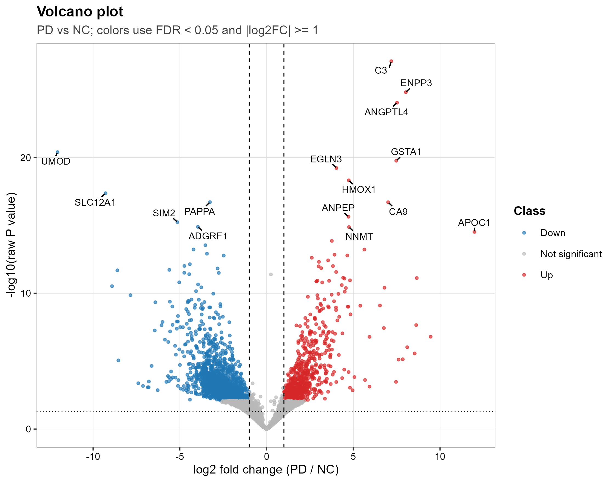

# Proyecto 4: Análisis de Expresión Diferencial (Bulk RNA-seq) - GSE160299
**Institución:** Universidad Autónoma Metropolitana  
**Autora:** Sandra Reyes Hernández  
**Fecha:** Junio 2026  
**Curso:** Cómputo Científico  

---

## 📝 Descripción del Proyecto

Este repositorio contiene el flujo de trabajo automatizado y robusto para el análisis de expresión diferencial de ARN-seq masivo (Bulk RNA-seq) a partir del dataset público **GSE160299** obtenido de la base de datos GEO (Gene Expression Omnibus).

El estudio analiza muestras de ARN en plasma/suero humano comparando dos grupos biológicos:
* **NC (Normal Control):** Pacientes de control sano ($n=4$).
* **PD (Parkinson's Disease):** Pacientes con la enfermedad de Parkinson ($n=4$).

El objetivo es identificar genes diferencialmente expresados (DEGs) que puedan servir como potenciales biomarcadores moleculares o dianas de estudio en la periferia celular de la enfermedad de Parkinson.

---

## 🛠️ Estructura del Repositorio

El repositorio está organizado siguiendo las mejores prácticas de reproducibilidad en bioinformática:

* `script_GSE160299.R`: Script principal en R que automatiza la descarga de datos, control de calidad, normalización estadística y visualización estilo GEO2R.
* `.gitignore`: Filtro para evitar la carga de archivos binarios pesados e intermedios a GitHub.
* `GSE160299_DESeq2_analysis/`: Carpeta generada automáticamente tras la ejecución del script (excluida parcialmente en Git por tamaño), estructurada en:
    * `data_raw/`: Datos crudos descargados de GEO.
    * `results/`: Matrices de conteos normalizados, tablas de expresión diferencial (`all_genes.csv` y `significant_FDR0.05_absLFC1.csv`).
    * `figures/`: Gráficas de diagnóstico de calidad y resultados biológicos.

---

## 📊 Gráfica Principal: Volcán (Volcano Plot)

A continuación se presenta el Volcano Plot obtenido del análisis estadístico con `DESeq2` (utilizando encogimiento de tasas de cambio con `apeglm` / `normal`). Esta gráfica contrasta el cambio en el nivel de expresión ($\log_2 \text{Fold Change}$) frente a la significancia estadística ($-\log_{10} \text{P-value}$).

Los umbrales establecidos para la significancia fenotípica fueron un $\text{FDR (padj)} < 0.05$ y un $|\log_2 \text{FC}| \ge 1.0$.



---

## 🚀 Requisitos e Instalación

El script cuenta con un sistema de instalación automática para dependencias faltantes. Los paquetes requeridos son:

* **CRAN:** `tidyverse`, `ggrepel`, `pheatmap`, `uwot`, `matrixStats`, `scales`, `janitor`, `ggvenn`.
* **Bioconductor:** `GEOquery`, `DESeq2`, `limma`, `AnnotationDbi`, `org.Hs.eg.db`, `apeglm`.

### Ejecución
Para reproducir el análisis completo, clona este repositorio y ejecuta desde la terminal de tu entorno configurado (ej. Ubuntu/WSL):

```bash
Rscript script_GSE160299.R